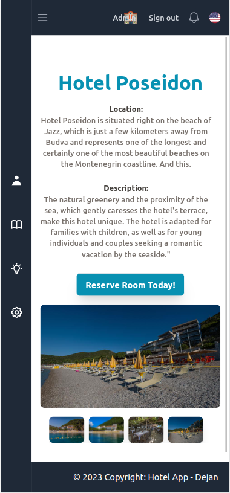
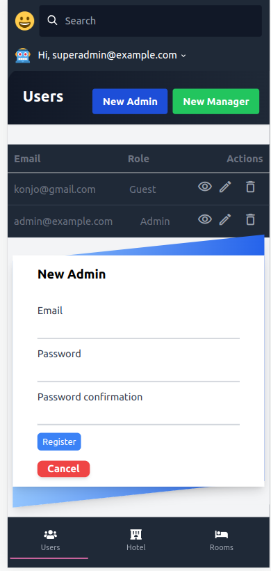
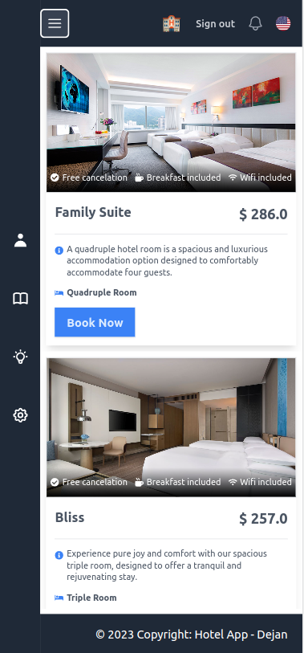

# Hotel App

The Hotel App is a Ruby on Rails web application that allows users to register, log in, and book hotel rooms. Additionally, it includes an admin panel to manage hotels, rooms, and bookings.

## Screenshots

<div style="display: flex; justify-content: space-between;">
  
  
  
</div>

## Features

- **User Registration:** Users can sign up for an account using their email and password.
- **User Login:** Registered users can log in using their credentials.
- **User Bookings:** Logged-in users can book hotel rooms.
- **Hotel Management (Admin):** Admin users can manage hotels, including adding, editing, and deleting hotels.
- **Room Management (Admin):** Admin users can manage rooms, including adding, editing, and deleting rooms.
- **Booking Management (Admin):** Admin users can view and manage bookings, including approving, canceling, and updating bookings.
- **Authentication:** The application uses Devise gem for user authentication.
- **Authorization:** The application implements authorization using role-based access control, allowing admins to perform management tasks.
- **Internationalization (i18n):** The application supports multiple locales to provide translations for different languages.
- **Styling:** The front-end is designed using Tailwind CSS to create a responsive and visually appealing user interface.

## Installation

1. Clone the repository:

```bash
 git clone https://github.com/DeVuDeveloper/hotel.git
```

2. Install the required gems:

```bash
 bundle install
bin/setup
```

3. Set up the database:

```bash
  rails db:create
  rails db:migrate
```


4. Run the server:

```bash
  bin/dev
```

## Dependencies

The Hotel App relies on the following main dependencies:

- Ruby on Rails: The web application framework used to build the app.
- Devise: A flexible authentication solution for Rails.
- Tailwind CSS: A utility-first CSS framework for styling the app.

## Tests

The Hotel App includes a test suite using RSpec. You can run the tests with the following command:

```bash
  rspec spec
```


## Usage

1. Open your web browser and navigate to `http://localhost:3000/`.
2. You will see the homepage with options to register and log in.
3. Click on "Register" to create a new user account.
4. After registering, you will be redirected to the login page.
5. Log in using your registered email and password.
6. Once logged in, you can view the available hotels, their rooms, and make bookings.
7. To access the admin panel, you need to have an admin account. You can create an admin account using the Rails console or seeds (if implemented).
8. Log in with the admin account to access the admin panel.
9. In the admin panel, you can manage hotels, rooms, and bookings.

## Contributing

Contributions are welcome! If you find any issues or have suggestions for improvements, please feel free to open an issue or create a pull request.

## License

The Hotel App is open-source software licensed under the [MIT License](LICENSE).

## Acknowledgments

- The Hotel App was created as a project for learning Ruby on Rails, Devise, and Tailwind CSS.
- Thanks to the creators and maintainers of the Ruby on Rails, Devise, and Tailwind CSS projects for their amazing work.

## Contact

For any inquiries or questions, you can reach me at dejanvu.developer@gmail.com.

Happy booking!

