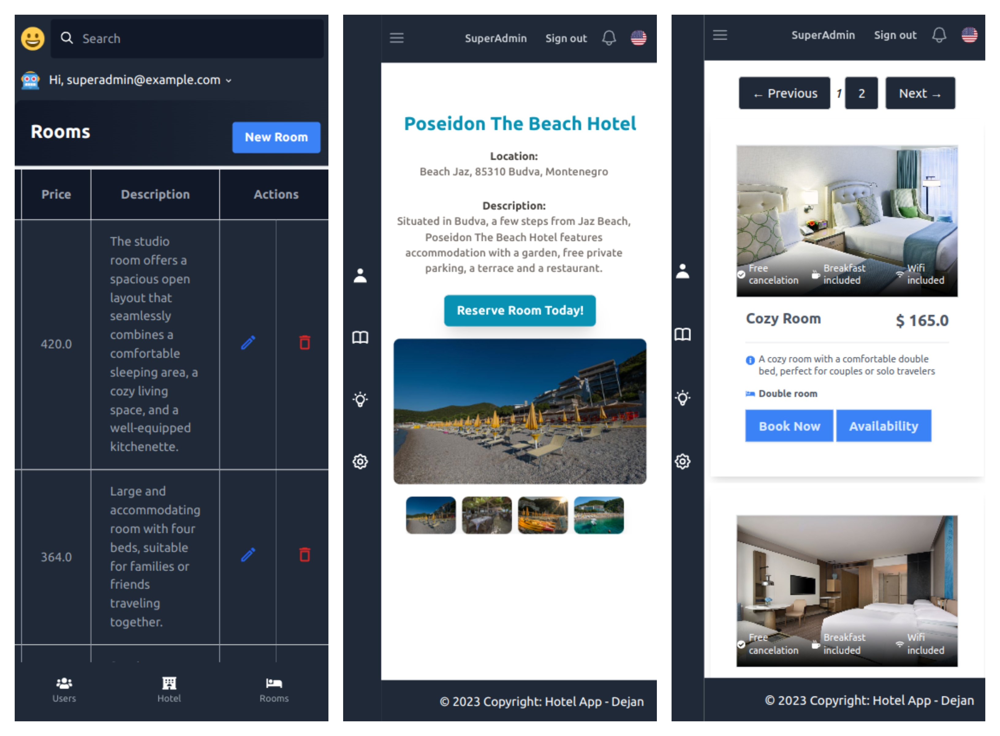

# Hotel App

The Hotel App is a modern Ruby on Rails web application designed for seamless hotel management, efficient user experience, and comprehensive reservation management. It features cutting-edge technologies including Rails Hotwire, Stimulus ad Vite ensuring dynamic interactions and responsiveness. The application includes an intuitive user registration and login system, empowering users to book hotel rooms hassle-free. Notably, the app boasts a robust admin panel for efficient hotel, room, and booking management.

## Screenshots

<div style="">
  

</div>

## Features

- **User Registration:** Users can effortlessly sign up for an account using their email and password, gaining access to a range of features.
- **User Login:** Registered users can quickly log in using their credentials, providing a seamless user experience.
- **User Bookings:** Logged-in users can conveniently browse and book hotel rooms with ease.
- **Modern Admin Panel:** The application includes a state-of-the-art admin panel, offering efficient management of hotels, rooms, and bookings.
- **Role-Based Access Control:** Authorization is implemented using role-based access control, granting admin users exclusive management privileges.
- **Multilingual Support:** The application is equipped with Internationalization (i18n) capabilities, ensuring language translations for diverse user bases.
- **Sleek Styling:** Tailwind CSS is employed to craft a visually appealing and responsive user interface, elevating the overall user experience.

## Installation


1. Clone the repository:

```bash
 git clone https://github.com/DeVuDeveloper/hotel.git
```

2. Install the required gems:

```bash
 bundle install
 bin/setup
```

3. Set up the database:

```bash
  rails db:create
  rails db:migrate
  rails db:seed
```


4. Run the server(Open your Browser and navigate to url: http://localhost:5100/): 

```bash
  bin/dev
```


## Dependencies

The Hotel App relies on the following main dependencies:

- Ruby on Rails: The web application framework used to build the app.
- Devise: A flexible authentication solution for Rails.
- Tailwind CSS: A utility-first CSS framework for styling the app.

## Linter

The Hotel App includes a linter. You can run the linter with the following command:

```bash
  rake standard && rake standard:fix
  npm run lint && npm run lint:fix
```

## Tests

The Hotel App includes a test suite using RSpec. You can run the tests with the following command:

```bash
  rspec spec
```

## Usage

1. Open your web browser and navigate to [http://localhost:5100/](http://localhost:3000/).
2. You will see the homepage with options to register and log in.
3. Click on "Register" to create a new user account.
4. After registering, you will be redirected to the login page.
5. Log in using your registered email and password.
6. Once logged in, you can view the available hotels, their rooms, and make bookings.
7. To access the admin panel, you need to have an admin account. You can create an admin account using the Rails console or seeds (if implemented).
8. Log in with the admin account to access the admin panel.
9. In the admin panel, you can manage hotels, rooms, and bookings.

## Contributing

Contributions are welcome! If you find any issues or have suggestions for improvements, please feel free to open an issue or create a pull request.

## License

The Hotel App is open-source software licensed under the MIT License.

## Acknowledgments

- The Hotel App was created as a project for learning Ruby on Rails, Devise, and Tailwind CSS.
- Thanks to the creators and maintainers of the Ruby on Rails, Devise, and Tailwind CSS projects for their amazing work.

## Contact

For any inquiries or questions, you can reach me at dejanvu.developer@gmail.com.

Happy booking!

